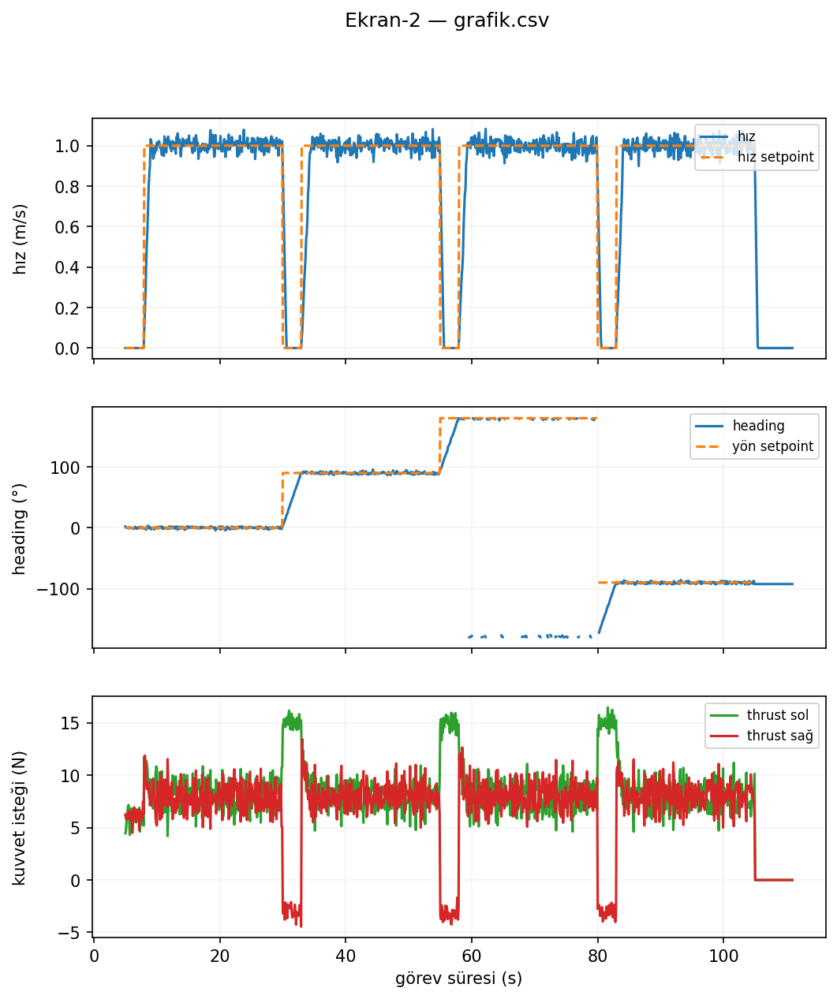
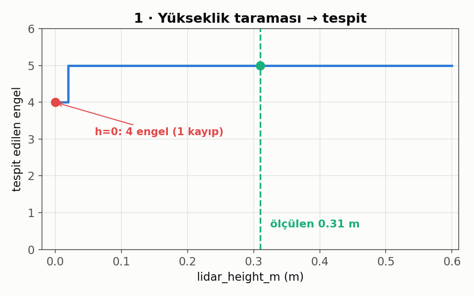
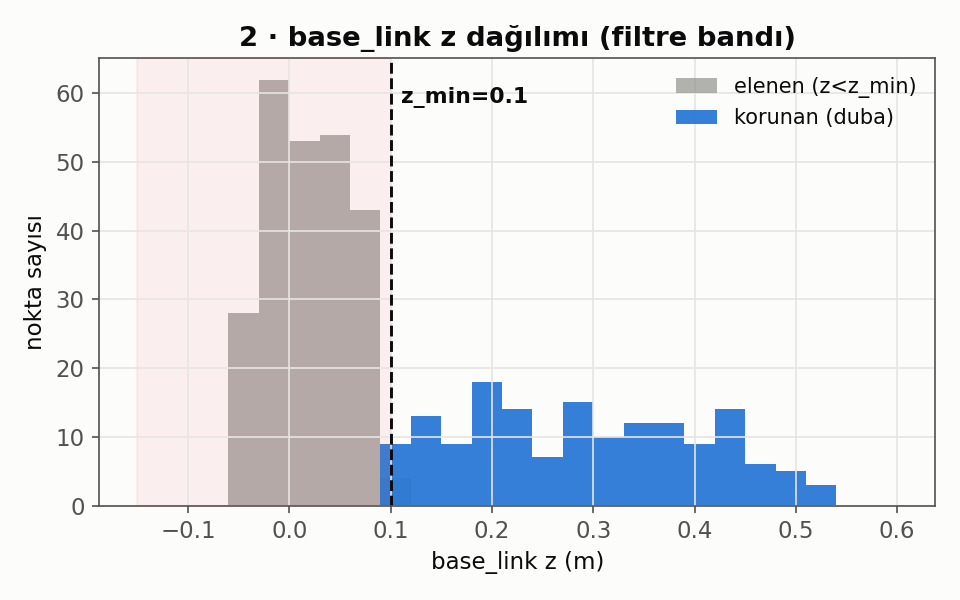
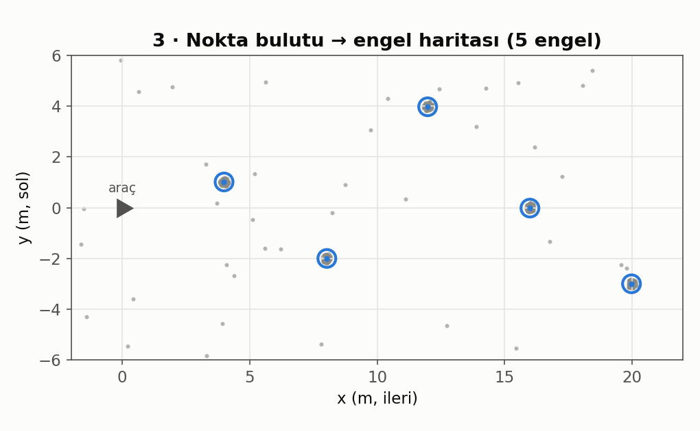
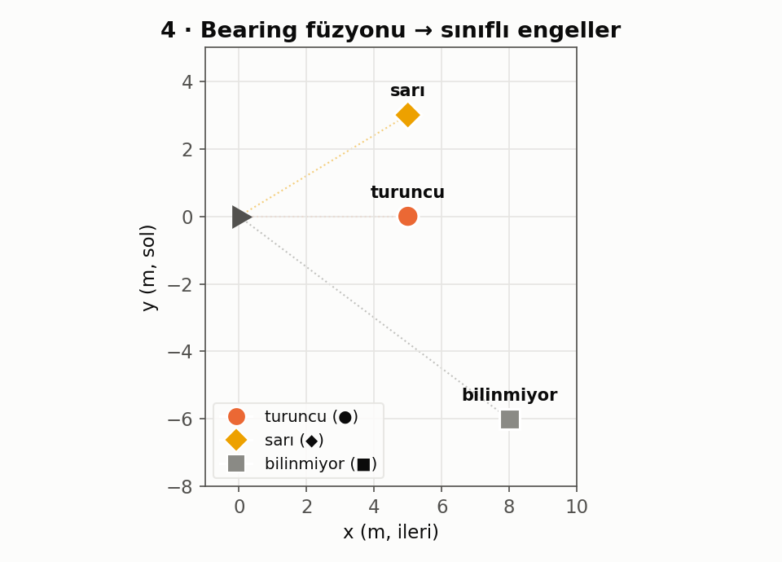

# jetsongeneltest1_grafLog — grafikler

## ⭐ Şartname md 3.3.1.1 — Ekran-2 (VİDEO TESLİM FORMATI)

Şartnamenin videoda istediği grafik. **Üç panel, şartname sinyal sırasıyla**
(2a gerçek hız + hız isteği, 2b heading AÇISI + yön isteği, 2c thruster kuvvet
isteği). Üretim kod yoluyla üretildi: gerçekçi 4-bacak dikdörtgen görev profili →
**gerçek `TelemetryCsvLogger`** → `grafik.csv` → **gerçek `ekran2.make_figure`**
(video montaj aracının aynısı; elle çizim yok).

- **Panel 2a** hız (mavi) + hız setpoint (turuncu kesik): 4 bacakta seyir 1 m/s,
  köşelerde 0'a iner.
- **Panel 2b** heading + yön setpoint: 0°→90°→180°→−90°; ±180 sarımı kırılıyor
  (dikey artefakt yok — `break_wraps`).
- **Panel 2c** thrust sol (yeşil) / sağ (kırmızı): düz seyirde ~eşit ileri,
  dönüşte diferansiyel; görev sonunda 0.

**Örnek veri dosyaları (şartname formatı):**
- `ornek_telemetri_Dosya2.csv` — **Dosya-2** (md 4.2), 2 Hz, `CSV_HEADER` birebir
  (`zaman,lat,lon,hiz,roll,pitch,heading,hiz_setpoint,yon_setpoint,mission_state`).
- `ornek_grafik.csv` — Ekran-2 kaynağı, 10 Hz (`GRAPH_CSV_HEADER`).

> Bunlar **format örneği** (gerçekçi sentetik görev profili); gerçek çekim
> verisi suda üretilir. Boş hücreler = boot/görev-dışı (NaN, sahte 0 yok).

---

## Ek: F5.1 mühendislik teşhis grafikleri

Aşağıdakiler şartname teslim formatı DEĞİL — F5.1 LiDAR çerçeve düzeltmesinin
doğrulama görselleri (gerçek çekirdek çıktısı: `detect_obstacles` + `associate`,
sahneler `scene_orta` + `scene_fusion_matched`). `index.html` = etkileşimli sürüm.

| | |
|---|---|
|  |  |
|  |  |

## 4 grafik
1. **Yükseklik taraması** — `lidar_height_m` 0→0.6 taranınca tespit edilen engel
   sayısı. h=0 (düzeltme yok) 1 duba kaybeder; ≥0.02'de 5/5 stabil (geniş plato =
   ±cm ölçüm toleransı). Ölçülen değer 0.31 işaretli.
2. **base_link z dağılımı** — su yüzeyi gürültüsü `z<z_min`'de toplanıp elenir,
   duba gövdeleri `[z_min, z_max]` bandında korunur.
3. **Nokta bulutu → engel haritası** (üstten) — base_link'e taşınmış ham noktalar
   → clustering → 5 daire engel.
4. **Bearing füzyonu** — LiDAR+kamera → renk sınıfı (turuncu/sarı/bilinmiyor),
   renk + şekil + etiket üçlü kodlama.

## F5.1 özeti
Ham Livox noktaları SENSÖR (livox_frame) çerçevesinde gelir; z_min/z_max ise
base_link (su datumu) çerçevesinde. Dönüşüm olmadan su hizası dubaları z_min ile
yanlış eleniyordu. Yeni `to_base_link()` noktaları filtrelemeden önce base_link'e
taşır (`lidar_height_m` yükseklik + opsiyonel `lidar_pitch_rad` eğim).

**Ölçüm:** `lidar_height_m = 0.31 m` (2026-07-17, kuru montaj: optik merkez → tekne
tabanı). **Doğrulama:** tam suite 340 passed / 2 skipped (+5 TDD).

Kod: kardeş klasör `jetsonvideokod_geneltest1_log/` (güncel main, F5.1 dahil).
