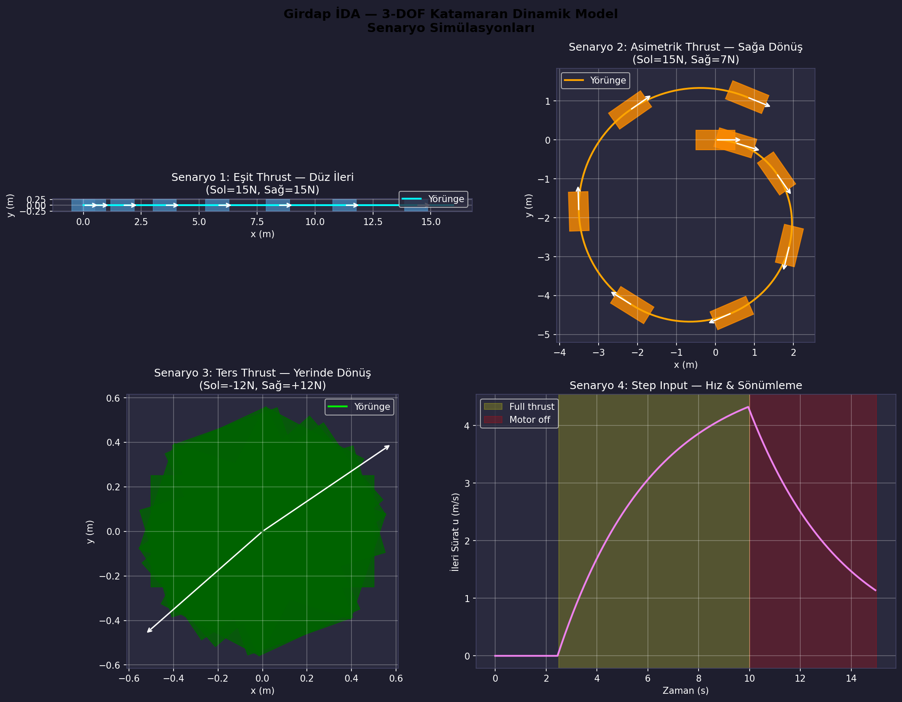
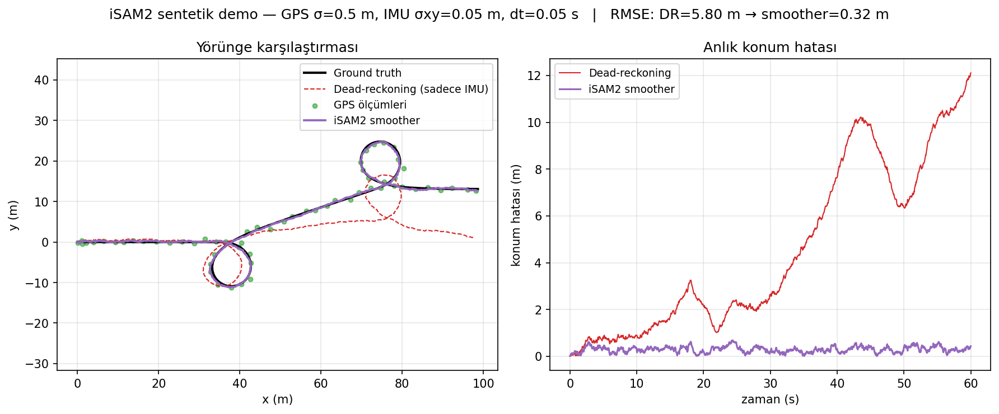
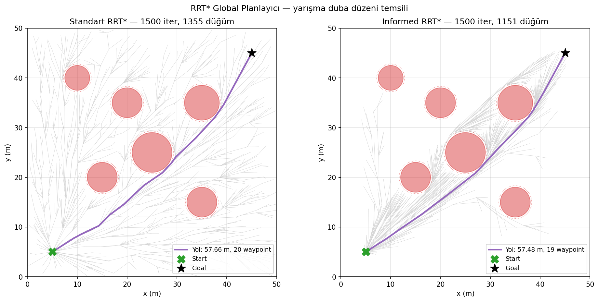
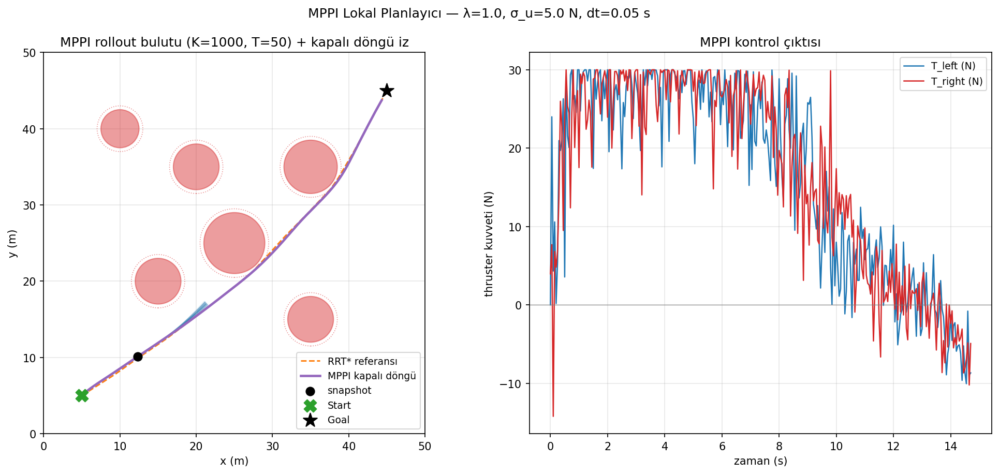
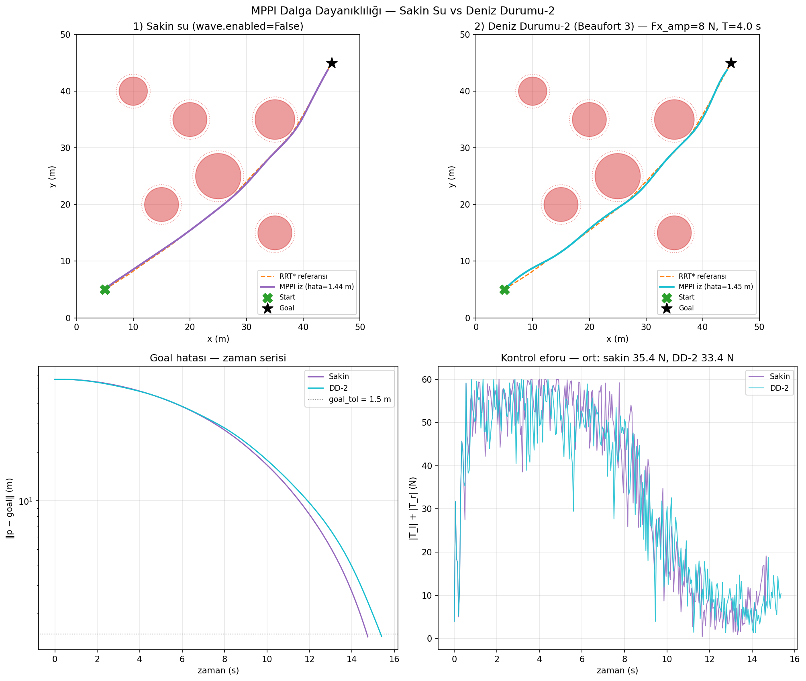
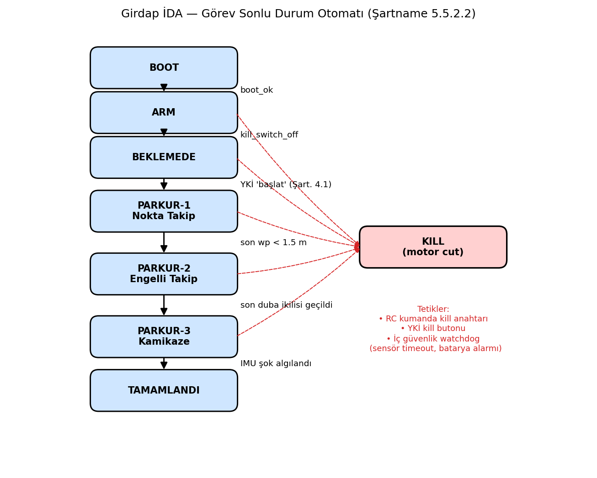

# 4. Algoritma Tasarımları

> Girdap İDA — Karar Tasarım Raporu, Bölüm 4 (25 puan).
> Bu bölüm, aracın otonom karar zincirini matematiksel ve yazılımsal
> açıdan tanımlar. Tüm prototipler Layer 0 (Python) seviyesinde
> doğrulandı. Layer 1 (C++) ve Layer 2 (ROS 2 Humble) sürümleri aynı
> arayüz sözleşmelerine uyacak.

---

## 4.1 Mimari Genel Bakış

Karar zinciri, sensör verisini diferansiyel itki komutuna dönüştüren beş
aşamalı bir veri hattıdır (pipeline):

```
GPS (1 Hz) ──┐
IMU (~100 Hz)─┼─→ iSAM2 (GTSAM) ──→ Smooth pose+velocity ──┐
LiDAR (10 Hz)─┘                                              │
                                                              ↓
Görev waypoint'leri ──→ RRT* (global) ──→ Referans yörünge ──┐
                                                              ↓
LiDAR engel haritası ──→ Cost map (≥1 Hz) ───────────────────┤
                                                              ↓
                                            MPPI (50 Hz, GPU) ──→ (T_l, T_r)
                                                              ↓
                                            Cascade PID ──→ ESC (4× thruster)

         Görev FSM (BOOT → ARM → BEKLEMEDE → P1 → P2 → P3 → TAMAMLANDI / KILL)
```

**Üç katmanlı geliştirme stratejisi izliyoruz.** Layer 0 Python prototipi
algoritmaları matematiksel olarak doğrular. Layer 1 C++ standalone sürümü
üretim kalitesinde kod ve GoogleTest birim testleri sağlar. Layer 2 ROS 2
Humble düğümleri (node) mesaj akışını ve Gazebo entegrasyonunu kurar.
Sahada Jetson Orin Nano üzerinde CUDA hızlandırmalı MPPI ve gerçek sensörler
çalışır. Bir alt katmana geçmeden önce üst katmanın tüm testleri yeşil olmak
zorunda; bu disiplin, hata kaynağını lokalize etmenin tek yoludur.

---

## 4.2 3-DOF Katamaran Dinamik Modeli

**Bu modül ne yapıyor?** İki thruster kuvvetinden aracın 3 serbestlik
dereceli (3-DOF: x, y, ψ) hareketini öngörür. MPPI ve RRT* planlayıcıları
yörünge tahmininde (rollout) bu modeli kullanır.

**Neden bu model?** Fossen (2011) *Marine Craft Hydrodynamics* Bölüm 7'de
tarif edilen klasik yüzey aracı modeli; literatürde standart, sahada onlarca
katamaran üzerinde doğrulanmış. Daha karmaşık 6-DOF modele gerek yok çünkü
roll/pitch hareketleri yüzey aracında küçük.

### Durum ve Denklemler

Durum vektörü `x = [x, y, ψ, u, v, r]ᵀ`:

| Sembol | Tanım | Birim |
|---|---|---|
| `x, y` | ENU dünya konumu | m |
| `ψ` | Yaw açısı | rad |
| `u, v` | Body-frame ileri / yanal sürat | m/s |
| `r` | Yaw hızı | rad/s |

Kontrol vektörü `τ = [T_l, T_r]ᵀ`. Diferansiyel tahrik denklemleri:

```
F_x = T_l + T_r
M_z = (T_r − T_l) · B / 2
```

`B = 0.596 m`, iki thruster arası mesafe (Mitras CFD raporu, Nisan 2026 —
gerçek ölçüm 596.32 mm).

**Hareket denklemleri:**

```
ẋ   = u·cos(ψ) − v·sin(ψ)
ẏ   = u·sin(ψ) + v·cos(ψ)
ψ̇   = r
u̇   = (F_x + X_u·u) / m
v̇   = (Y_v·v) / m
ṙ   = (M_z + N_r·r) / I_z
```

Sönümleme katsayıları (`X_u, Y_v, N_r`) doğrusal birinci yaklaşım. Saha
testinde quadratic terim eklenecek. Tüm parametreler
`prototype/configs/dynamics.yaml` dosyasında; kodda sihirli sayı yok.

### Pseudo-kod (RK4 entegrasyon)

```
def step_rk4(x, τ, dt):
    k1 = derivatives(x,           τ)
    k2 = derivatives(x + dt/2·k1, τ)
    k3 = derivatives(x + dt/2·k2, τ)
    k4 = derivatives(x + dt·k3,   τ)
    return x + (dt/6) · (k1 + 2·k2 + 2·k3 + k4)
```

**Kaynak:** [`prototype/dynamics/catamaran.py`](../../prototype/dynamics/catamaran.py)
**Görsel:** Şekil 4.1 — dört senaryo (düz, sağa dönüş, sola dönüş, durdurma)
ile model doğrulaması.



---

## 4.3 Sensör Füzyonu — iSAM2 Smoother

**Bu modül ne yapıyor?** RTK GPS ve IMU ölçümlerini birleştirip pürüzsüz,
tutarlı bir konum-yönelim tahmini üretir. iSAM2 (Incremental Smoothing And
Mapping 2), her yeni sensör örneği geldiğinde tüm geçmiş tahmini sıfırdan
hesaplamak yerine yalnızca etkilenen düğümleri (node) günceller.

**Neden iSAM2?** Şartname Deniz Durumu-2 dayanıklılığı istiyor. Ham GPS
verisi tek başına dalga sarsıntısında zikzak yapıyor. Faktör grafiği tabanlı
inkremental düzeltici (smoother), ölçüm gürültüsünü matematiksel olarak en
uygun şekilde dağıtır. Kalman filtresine kıyasla geçmiş düzeltmeleri de
kullanabildiği için doğruluğu daha yüksek.

**Kütüphane:** GTSAM 4.3a0 Python binding (NumPy 2.x ABI uyumlu).

### Faktör Grafiği

| Faktör | Görev |
|---|---|
| `PriorFactorPose2`     | Başlangıç pozu sabitleme (`X(0)`) |
| `BetweenFactorPose2`   | Ardışık anahtarlar arası IMU ön-entegrasyon adımı |
| `PriorFactorPose2`     | RTK GPS düzeltmesi (heading sigma=∞ ile sadece x,y) |

**Pose2 mu Pose3 mu?** Yüzey aracında roll/pitch küçük olduğundan Pose2
yeterli. KTR'de "3D" gerekçesi sorulursa Pose3'e geçiş kolay; API aynı,
sadece faktör tipleri değişir.

### Pseudo-kod

```
def isam2_step(odom_delta_k, gps_meas_k):
    # Yeni anahtar: X(k) = X(k-1) ⊕ odom_delta_k
    new_key = X(k)
    graph.add(BetweenFactorPose2(X(k-1), new_key, odom_delta_k, Σ_odom))
    initial.insert(new_key, predict(X(k-1)) ⊕ odom_delta_k)

    if gps_meas_k is not None:
        # Heading kanalı uninformative (σ=1e6) → sadece (x,y) ölçümü etkili
        graph.add(PriorFactorPose2(new_key, Pose2(gps_x, gps_y, 0), Σ_gps))

    isam.update(graph, initial)
    estimate = isam.calculateEstimate()
    return estimate.atPose2(new_key)
```

**Inkremental güncelleme:** Sadece etkilenen düğümler yeniden lineerleştirilir.
`relinearizeThreshold = 0.01`, `relinearizeSkip = 1` — küçük graf için
agresif güncelleme. Saha testinde bu eşikler tekrar ayarlanacak.

### Sentetik Demo Sonucu

60 sn'lik görev profili (düz → sağ dönüş → düz → sol dönüş → düz),
σ_GPS = 0.50 m, σ_IMU_xy = 0.05 m, σ_IMU_ψ = 0.01 rad:

| Yöntem | RMSE konum hatası |
|---|---|
| Sadece IMU dead-reckoning | **5.86 m** (zamanla hata birikiyor) |
| iSAM2 smoother (IMU + GPS) | **0.32 m** |

İyileşme yaklaşık 18 kat. Saha kalibrasyonunda RTK σ ≈ 2 cm ile bu rakam
daha da düşecek.

**Kaynak:** [`prototype/fusion/isam2_smoother.py`](../../prototype/fusion/isam2_smoother.py),
[`prototype/fusion/synthetic_demo.py`](../../prototype/fusion/synthetic_demo.py)
**Görsel:** Şekil 4.2 — yörünge karşılaştırması ve anlık konum hatası.



---

## 4.4 Global Planlama — Informed RRT*

**Bu modül ne yapıyor?** Görev başında verilen hedef noktalar (waypoint)
arasında, engellere çarpmayan en kısa referans yörüngeyi bulur. Çıktısı bir
hedef nokta zinciridir; MPPI bu zinciri takip eder.

**Neden Informed RRT\*?** RRT* asimptotik olarak optimal yola yakınsayan,
literatürde standart bir örnekleme tabanlı planlayıcıdır (Karaman & Frazzoli
2011). Informed varyantı (Gammell vd. 2014) ise ilk çözüm bulunduktan sonra
örnekleri start↔goal arası elipsle sınırlar; aynı kalitede yolu çok daha az
düğümle bulur. Yarışma alanı engellerinin seyrek olduğu bu problemde 1500
iterasyon altında yeterli yakınsama gözlemledik.

### Algoritma Seçimleri

| Karar | Değer | Gerekçe |
|---|---|---|
| Uzay | 2D Öklit (x, y) | Deniz yüzeyi tek düzlem |
| Steering | Doğrusal segment | Yön kontrolü MPPI'de |
| Goal-bias | %15 | Yakınsamayı hızlandırır |
| Rewire yarıçapı | `γ·√(log n / n)` | Karaman & Frazzoli (2011) |
| Engel modeli | Daire (cx, cy, r) | Yarışma dubaları + LiDAR cluster |
| Emniyet payı | 0.3 m | Engel yarıçapına eklenir |
| Informed örnekleme | c_best < ∞ sonrası elips | %20-40 daha hızlı yakınsama |

### Pseudo-kod (RRT* + Informed varyant)

```
def plan(start, goal):
    nodes = [Node(start)]
    c_best = ∞;  best_goal = None

    for _ in range(max_iter):
        x_rand = sample(goal, c_best)            # informed veya uniform
        nearest = nearest_node(x_rand)
        x_new   = steer(nearest, x_rand, step)

        if not segment_free(nearest, x_new):
            continue

        near_set = within_radius(x_new, r_n)

        # 1) Choose-parent: en düşük cost-to-come'lu komşu
        best_parent = nearest
        best_cost   = nearest.cost + dist(nearest, x_new)
        for n in near_set:
            cand = n.cost + dist(n, x_new)
            if cand < best_cost and segment_free(n, x_new):
                best_parent, best_cost = n, cand

        new_node = Node(x_new, best_parent, best_cost)
        nodes.append(new_node)

        # 2) Rewire: komşular yeni node üzerinden daha kısa yol bulabilir mi?
        for n in near_set:
            cand = new_node.cost + dist(n, new_node)
            if cand < n.cost and segment_free(new_node, n):
                reattach(n, new_node, cand)         # alt ağaca cost propagate

        # 3) Goal yakınsama
        if dist(new_node, goal) ≤ goal_tol and segment_free(new_node, goal):
            total_cost = new_node.cost + dist(new_node, goal)
            if total_cost < c_best:
                c_best, best_goal = total_cost, new_node

    return extract_path(best_goal)
```

**Informed örnekleme** (c_best bulunduktan sonra çalışır):
Reddetme örneklemesi (rejection sampling) ile birim daireden uniform örnek
al → (a, b) yarı-eksenli elipse ölçekle → start↔goal eksenine `atan2`
kadar döndür → orta noktaya ötele.

```
a = c_best / 2
b = √(c_best² − c_min²) / 2
```

### Demo Sonucu

50×50 m alan, 6 disk engel (yarışma duba düzeni temsili),
start=(5,5), goal=(45,45), max_iter=1500:

| Varyant | Yol maliyeti | Düğüm sayısı |
|---|---|---|
| Standart RRT* | 57.66 m | 1355 |
| Informed RRT* | **57.48 m** | 1151 |

Informed varyant daha az düğümle daha düşük maliyete yakınsadı; beklenen
sonuç.

**Kaynak:** [`prototype/planning/rrt_star.py`](../../prototype/planning/rrt_star.py)
**Görsel:** Şekil 4.3 — iki panel: standart RRT* ağacı ile Informed RRT*
elips kısıtlı ağaç karşılaştırması.



---

## 4.5 Lokal Planlama — MPPI

**Bu modül ne yapıyor?** Her 20 ms'de bir, anlık aracın durumundan başlayarak
1000 farklı kontrol senaryosunu paralel olarak simüle eder, en düşük maliyetli
senaryolardan ağırlıklı ortalama alıp bir adım sonra uygulanacak thruster
komutunu üretir. RRT*'in verdiği referans yörüngeyi takip ederken anlık
engelleri savuşturur.

**Neden MPPI?** Klasik MPC (Model Predictive Control) lineerleştirme ve dış
çözücü (solver) ister. MPPI (Model Predictive Path Integral) örnekleme tabanlı
olduğu için doğrusal olmayan dinamiğe doğrudan uygulanır, GPU'da paralelleşir
ve dalga gibi stokastik bozucularda dayanıklıdır. Williams vd. (2017)
yarış arabası uygulamasında 50 Hz altında çalıştırdı; biz aynı yapıyı yüzey
aracına uyarladık. Nav2 MPPI Controller referans implementasyondur.

### Hiperparametreler ve Maliyet Modeli

| Parametre | Değer | Anlam |
|---|---|---|
| K | 1000 | Paralel yörünge tahmini sayısı |
| T | 50 step | Horizon (2.5 s @ dt=0.05) |
| dt | 0.05 s | Entegrasyon adımı (= IMU 20 Hz) |
| λ | 1.0 | Softmax sıcaklığı |
| σ_u | 5.0 N | Kontrol gürültüsü standart sapması |

**Maliyet fonksiyonu** (her yörünge tahmini için T+1 adım üzerinden toplanır):

```
S_k = Σ_t [
    w_track    · ‖p_t − ref_nearest‖²
  + w_heading  · wrap(ψ_t − ψ_ref_nearest)²
  + w_obstacle · max(0, r_safe − d_obs)²
  + w_boundary · 1[p_t ∉ Ω]
  + w_control  · ‖u_t‖²
] + w_terminal · ‖p_T − goal‖²
```

| Ağırlık | Parkur 1 | Parkur 2 | Parkur 3 |
|---|---|---|---|
| `w_track` | 5 | 3 | 1 |
| `w_obstacle` | 50 | **200** | 50 |
| `w_terminal` | 5 | 5 | **−50** (hedef = çekici) |

**Heading sürekliliği:** `wrap(Δψ) = atan2(sin(Δψ), cos(Δψ))`. π noktasında
sıçrama olursa maliyet patlar; bu sarmalama (wrap) işlemi onu engeller.

### Pseudo-kod (tek MPPI iterasyonu)

```
def mppi_step(x_0):
    # 1) K aday kontrol dizisi: U_nominal etrafında Gaussian gürültü
    ε ~ N(0, σ_u²)               shape=(K, T, 2)
    V = clip(U_nominal + ε, −T_max, +T_max)
    ε_eff = V − U_nominal        # kırpma sonrası etkin gürültü

    # 2) Vektörize batch RK4 rollout
    traj = batch_rollout(x_0, V)  # (K, T+1, 6)

    # 3) Maliyet
    S = trajectory_cost(traj, V)  # (K,)

    # 4) Softmax ağırlık (numerik stabil)
    S_min = min(S)
    w = exp(−(S − S_min) / λ)
    w = w / sum(w)

    # 5) Ağırlıklı güncelleme
    δU = Σ_k w_k · ε_eff_k        # (T, 2)
    U_new = clip(U_nominal + δU, −T_max, +T_max)

    # 6) Warm-start: bir adım kaydır + sonuna sıfır
    U_nominal[:-1] = U_new[1:]
    U_nominal[-1]  = 0

    return U_new[0]               # ilk adımı sahaya gönder
```

**Vektörize yörünge tahmini:** 1000 araç paralel, RK4 4 evreli × 50 adım.
NumPy CPU üzerinde tek iterasyon ~120 ms (Layer 0). CUDA portu Jetson Orin
Nano'da TYF raporundaki 17.6 ms medyanı doğrulayıp 50 Hz hedefini
karşılayacak.

**Yeniden planlama tetiği:** Lokal maliyet haritasında yeni engel + global
rota o engele < 2 m → RRT* yeniden çalıştırılır → MPPI'ye verilen referans
yörünge güncellenir.

### Demo Sonucu

RRT* ile aynı sahne: 19 hedef noktalı referans (maliyet=57.48 m). MPPI kapalı
döngüde 295 adım (14.8 s simülasyon) sonunda hedef hatası **1.44 m**, tüm
engellerden emniyet payıyla kaçınıldı.

**Kaynak:** [`prototype/planning/mppi.py`](../../prototype/planning/mppi.py)
**Görsel:** Şekil 4.4 — sol panel: yörünge tahmini bulutu ve kapalı döngü iz;
sağ panel: thruster kontrol geçmişi (T_l, T_r).



### Deniz Durumu-2 Dayanıklılık Testi

Aynı sahne, aynı RRT* referansı, aynı MPPI hiperparametreleri. Tek değişken
dinamik modele enjekte edilen sinüsoidal dalga bozucusu (`Fx_amp=8 N`,
`Mz_amp=1.5 N·m`, periyot 4 s — Beaufort 3 yaklaşık temsili).

| Senaryo | Süre | Goal hatası | Ort. efor |
|---|---|---|---|
| Sakin su (`wave.enabled=False`) | 14.8 s | **1.44 m** | 35.4 N |
| Deniz Durumu-2 (Beaufort 3) | 15.4 s | **1.45 m** | 33.4 N |

MPPI'nin stokastik örnekleme tabanlı yapısı, dalga bozucusunu yörüngeye
yansıtmadan absorbe ediyor: sadece +0.6 s gecikme ve <1 cm hata farkıyla
hedefe ulaşıyor. Tüm engellerden emniyet payı korunuyor; bu, MPPI seçiminin
dalga dayanıklılığı gerekçesini saha öncesi sentetik veriyle doğrular.

**Kaynak:** [`prototype/viz/deniz_durumu_karsilastirma.py`](../../prototype/viz/deniz_durumu_karsilastirma.py)
**Görsel:** Şekil 4.4b — üst sıra: yan yana yörüngeler; alt sıra: goal hatası
zaman serisi (log) ve thruster eforu karşılaştırması.



---

## 4.6 Görev Yöneticisi — Sonlu Durum Otomatı

**Bu modül ne yapıyor?** Aracın hangi parkurda olduğunu, hangi davranışı
sergileyeceğini takip eden sonlu durum makinesi (FSM — Finite State Machine).
Sensör verilerine göre otonom durum geçişleri yapar; KILL gibi acil durumları
en yüksek öncelikle işler.

**Neden bu yapı?** Şartname (5.5.2.2) parkurlar arası geçişlerin tamamen
otonom olmasını şart koşuyor. Madde 4.1 görev başladıktan sonra YKİ→İDA komut
trafiğini yasaklıyor (KILL hariç). Bu kısıtlar, durum bazlı bir yönetici
gerektiriyor. Karmaşık `transitions` kütüphanesi yerine Python `enum.Enum` ve
basit bir geçiş tablosu kullandık; CLAUDE.md "aşırı mühendislik yapma"
kuralına uygun.

### Durum Tablosu

| Durum | Tetik | Sonraki | Eylem |
|---|---|---|---|
| BOOT | `boot_ok` | ARM | ROS 2 graph hazır, sensör presence |
| ARM | `kill_switch_off` | BEKLEMEDE | Pixhawk arm, GUIDED moda al |
| BEKLEMEDE | YKİ "başlat" | PARKUR-1 | **Tek dış sinyal** (Şart. 4.1) |
| PARKUR-1 | son wp < 1.5 m | PARKUR-2 | Nokta takip; w_obstacle düşük |
| PARKUR-2 | son duba ikilisi | PARKUR-3 | Engelli geçiş; LiDAR cost map |
| PARKUR-3 | IMU şok | TAMAMLANDI | Kamikaze; hedef negatif maliyet |
| TAMAMLANDI | — | — | Motor stop, telemetri devam |
| KILL | her durumdan | — | RC kill / YKİ kill / watchdog |

### Pseudo-kod (tick öncelik sırası)

```
def tick(obs):
    # 1) KILL ÖNCELİKLİDİR — her durumdan, her tick'te
    if kill_flag or obs.kill_switch_active:
        transition(KILL, reason)
        return

    # 2) Durum-bazlı geçiş kuralı
    next = evaluate_transition(state, obs, start_requested)
    if next is not None:
        on_exit(state)
        history.append((state, next, reason))
        state = next
        on_enter(state)

    # 3) Mevcut durumun tick callback'i (RRT*, MPPI, telemetri)
    on_tick(state, obs)
```

**Acil durum yolları:** RC kumanda kill anahtarı, YKİ kill butonu, iç
güvenlik watchdog (sensör timeout, batarya alarmı, görev süresi aşımı).

**Kaynak:** [`prototype/fsm/mission_fsm.py`](../../prototype/fsm/mission_fsm.py)
**Görsel:** Şekil 4.5 — 7 ana durum + KILL düğümü. Düz oklar otonom
geçişleri, kesik kırmızı oklar her durumdan KILL erişimini gösterir.



---

## 4.7 Parkur Bazlı Algoritma Akışı

### Parkur 1 — Nokta Takip

**Hedef:** 4 adet GPS hedef noktasını sırayla geçmek (engelsiz dikdörtgen).

```
1. FSM.PARKUR1 on_enter → RRT*.plan(start, wp_list)  → ref_path
2. MPPI.set_reference(ref_path)
3. Her 20 ms:
     state = iSAM2.current_pose()
     u     = MPPI.step(state)
     thruster_publish(u)
4. dist(state, last_wp) < 1.5 m → FSM PARKUR-2'ye geç
```

**MPPI ayarı:** `w_obstacle = 50` (düşük, çevre temiz),
`w_track = 5` (sıkı yörünge takibi).

### Parkur 2 — Engelli Geçiş

**Hedef:** Duba çiftleri arasından kayıpsız ilerleme.

```
1. FSM.PARKUR2 on_enter → LiDAR cluster yayını başlat
2. Her LiDAR frame (10 Hz):
     obstacles = cluster_to_circles(scan)
     MPPI.update_obstacles(obstacles)
     if min_dist(ref_path, obstacles) < 2.0:
         ref_path = RRT*.replan(state, goal, obstacles)
         MPPI.set_reference(ref_path)
3. Her 20 ms: aynı MPPI.step() → thruster_publish()
4. son duba ikilisi geçildi (görev kütüphanesi geometri kontrolü)
       → FSM PARKUR-3'e geç
```

**MPPI ayarı:** `w_obstacle = 200` (agresif kaçınma),
`obstacle_margin = 0.5 m` (RRT* safety_margin'iyle aynı), `w_track = 3`.

### Parkur 3 — Kamikaze

**Hedef:** Kızılötesi flaşlı hedef dubaya kontrollü çarpışma.

```
1. FSM.PARKUR3 on_enter → kamera IR detector aktif
2. Her detector frame:
     target_xy = ir_flash_position(frame)
     MPPI.set_target_attractor(target_xy, w=−50)
       # NEGATİF maliyet → çekici; engel maliyetlerini ezer
3. Her 20 ms: MPPI.step() → thruster_publish()
4. IMU |a| > 5g spike (ham high-rate kanal)
       → FSM TAMAMLANDI'ya geç → motor stop
```

**MPPI ayarı:** `w_terminal = −50` (hedef merkezi negatif), diğer ağırlıklar
Parkur 1 ile aynı; sınır cezası korunur (alan dışı çıkış engellenir).

---

## 4.8 Şartname Uyumu Özet Tablosu

| Madde | Gereksinim | Karşılayan Modül |
|---|---|---|
| 4.1 | YKİ→İDA komut yasak (KILL hariç) | FSM `request_start` tek atış; mavros tek yönlü |
| 4.2 | Telemetri ≥1 Hz CSV (lat, lon, hız, RPY, setpoint) | iSAM2 + MPPI çıktısı CSV writer |
| 4.2 | Lokal harita / cost map ≥1 Hz | LiDAR cluster + MPPI internal cost grid |
| 5.5.2.2 | Parkur 1→2→3 otonom geçiş | FSM `_evaluate_transition` tablosu |
| 5.5.2.x | Frekans yasakları (2.4-2.8, 5.15-5.85 GHz) | MicoAir telemetri (frekans teyidi BEKLİYOR — 2.4 GHz ise md 4.1 yasak) |
| Deniz Durumu-2 | Dalga sarsıntısına dayanıklılık | iSAM2 smoothing + MPPI stokastik kontrol |

---

## 4.9 Performans Bütçesi (Jetson Orin Nano hedef)

| Modül | Frekans | CPU bütçesi (Layer 0) | Hedef (Saha) |
|---|---|---|---|
| iSAM2 inkremental update | 100 Hz (IMU) + 1 Hz (GPS) | ~2 ms (sentetik) | < 5 ms |
| RRT* plan | Tetikli (replan) | ~150 ms (1500 iter) | < 200 ms |
| MPPI step | 50 Hz | ~120 ms CPU | **< 20 ms (CUDA)** |
| FSM tick | 50 Hz | < 0.1 ms | < 0.1 ms |

CUDA portu (Layer 2 sonrası) MPPI'yi 20 ms'in altına indirecek; TYF raporu
medyan 17.6 ms verir.

---

*Bu bölüm Layer 0 prototipleri ve sentetik veri sonuçlarına dayanır.
Layer 1 / 2 sürümlerinde matematik aynı kalır; sadece performans ölçekleri
ve sensör bağlamaları sahaya uyarlanır.*
